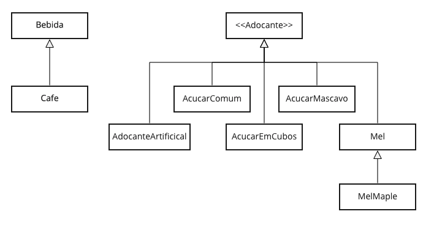

# Cafe Liskov

Quando escrevemos código, sempre temos duas opções: Escrever de qualquer jeito sabendo de antemão que seremos as únicas criaturas vivas capazes de tocar nele novamente ou escrevê-lo seguindo padrões de alta qualidade para que os outros desenvolvedores encontrem uma estrada boa e bem pavimentada.

É fácil perceber quando nos deparamos com um código mal feito. Dizemos que o código cheira mal. É difícil de entender, uma pequena mudança faz com que pare de funcionar e depurar é simplesmente um pesadelo. Por outro lado, quando nos deparamos com um bom código esse é fácil entender, e de alterar. Ele nos dá a confiança para tocá-lo imediatamente. Um código bem feito torna nossas vidas melhores!

Mas um bom código não acontece por mágica. Nós, desenvolvedores, precisamos gastar tempo aprendendo as melhores práticas e as convenções da linguagem antes de alcançar padrões de alta qualidade.

Um bom começo é começar a aprender os princípios SOLID.

SOLID é um acrônimo que cobre 5 bons princípios de design de software.

- S - Responsabilidade Única (Single Responsibility)
- O - Aberto / Fechado (Open/Closed)
- L - Substituição de Liskov (Liskov Substituition)
- I - Segregação de Interface (Interface Segregation)
- D - Injeção de dependência (Dependency Injection)

Hoje vamos aprender como aplicar na prática o princípio da Substituição de Liskov.

> _"Em teoria, teoria e prática são iguais, na prática não!_"

O princípio dita que “Os objetos em um programa devem ser substituíveis por instâncias de seus subtipos sem alterar a exatidão desse programa”.

Uma maneira simples de aprender isso é fazendo primeiro uma analogia. Pense no café. Podemos ter café adoçado com diferentes substâncias. Quando projetamos uma máquina de café, devemos ser capazes de escolher açúcar comum, açúcar mascavo, mel ou adoçante artificial.

A primeira tentação seria criar uma classe de café que pode ser adoçada por todas essas substâncias:

```java
public class Cafe extends Bebida {
  public void adicionarAcucarComum(AcucarComum acucarComum) {
    acucarComum.adocar(this);
  }

  public void adicionarAcucarEmCubos(AcucarEmCubos acucarEmCubos) {
    acucarEmCubos.adocar(this);
  }

  public void adicionarAcucarMascavo(AcucarMascavo acucarMascavo) {
    acucarMascavo.adocar(this);
  }

  public void adicionarMel(Mel mel) {
    mel.adocar(this);
  }

  public void adicionarAdocanteArtificial(AdocanteArtificial adocanteArtificial) {
    adocanteArtificial.adocar(this);
  }
}
```

Nossa cafeteira faria cafe dessa maneira:

```java
public class Cafeteira {
    public static void main( String[] args )
    {
        System.out.println( "Bem vindo ao Cafe Sem Liskov!" );

        Cafe cafezinho = new Cafe();

        AcucarComum acucarComum = new AcucarComum();
        AcucarEmCubos acucarEmCubos = new AcucarEmCubos();
        AcucarMascavo acucarMascavo = new AcucarMascavo();
        Mel mel = new Mel();
        AdocanteArtificial adocanteArtificial = new AdocanteArtificial();

        cafezinho.adicionarAcucarComum(acucarComum);
        cafezinho.adicionarAcucarEmCubos(acucarEmCubos);
        cafezinho.adicionarAcucarMascavo(acucarMascavo);
        cafezinho.adicionarAcucarEmCubos(acucarEmCubos);
        cafezinho.adicionarMel(mel);
        cafezinho.adicionarAdocanteArtificial(adocanteArtificial);

        System.out.println( cafezinho.saborAdocicado + " está doce demais!" );
    }
}
```

Como você pode notar, toda vez que quisermos adicionar um novo adoçante à lista, precisaremos alterar a classe Cafe. Isso dará uma trabalheira! :(

Também podemos notar que todas essas substâncias têm o mesmo comportamento. Isso significa que eles podem ser representados pela mesma subclasse ou interface. Aplicando o princípio de substituição de Liskov, obteríamos algo assim:

```java
public interface Adocante {
  public void adocar(Bebida b);
}

public class AcucarComum implements Adocante {
  @Override
  public void adocar(Bebida bebida) {
    bebida.saborAdocicado+=1;
  }
}

public class AcucarEmCubos implements Adocante {
  @Override
  public void adocar(Bebida bebida) {
    bebida.saborAdocicado+=1;
  }
}
...
```

Dessa forma, podemos melhorar também as classe Cafe e Cafeteira tornando-as bem mais simples:

```java
public class Cafe extends Bebida {
  public void adicionarAdocante(Adocante adocante) {
    adocante.adocar(this);
  }
}

public class Cafeteira {
    public static void main( String[] args )
    {
        System.out.println( "Bem vindo ao Cafe Liskov!" );

        Cafe cafezinho = new Cafe();

        Adocante acucarComum = new AcucarComum();
        Adocante acucarEmCubos = new AcucarEmCubos();
        Adocante acucarMascavo = new AcucarMascavo();
        Adocante adocanteArtificial = new AdocanteArtificial();
        Adocante mel = new Mel();

        cafezinho.adicionarAdocante(acucarComum);
        cafezinho.adicionarAdocante(acucarEmCubos);
        cafezinho.adicionarAdocante(acucarMascavo);
        cafezinho.adicionarAdocante(acucarEmCubos);
        cafezinho.adicionarAdocante(mel);
        cafezinho.adicionarAdocante(adocanteArtificial);

        System.out.println( cafezinho.saborAdocicado + " agora está saboroso!" );
    }
}
```

Podemos ver que agora, além de mais simples, podemos adicionar novos adoçantes à nossa máquina sem grandes mudanças. Então, vamos fazer exatamente isso! Adicionemos um novo mel oriundo do Canada chamdo MelMaple. O MelMapple será uma extensão de Mel e por herança também um adoçante válido.

```java
public class MelMaple extends Mel {
  @Override
  public void adocar(Bebida bebida) {
    bebida.saborAdocicado += 3;
  }
}
```



Como o princípio da Substituição de Liskov dita, podemos trocar as instâncias do adoçante (subclasses) sem alterar a exatidão do nosso programa. Adicionamos um MelMaple e a máquina de café continua funcionando conforme o esperado.

```java


public class Cafeteira {
    public static void main( String[] args )
    {
        System.out.println( "Bem vindo ao Cafe Liskov!" );

        Cafe cafezinho = new Cafe();

        Adocante melMaple = new MelMaple();
        cafezinho.adicionarAdocante(melMaple);

        System.out.println( cafezinho.saborAdocicado + " simplesmente delicioso!" );
    }
}
```
Em resumo:

- O princípio de substituição de Liskov é um dos princípios de design SOLID

- O princípio de subistituição de Liskov trata do uso de herança e interfaces para simplificar e tornar nossos programas mais resilientes às mudanças

Na próxima vez que você construir suas classes, lembre-se do Café Liskov!
